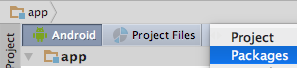

# aauto-sdk

This is an unofficial SDK for Android Auto.

## Note

With great power comes great responsibility.
Do not write apps that distract drivers.
Distraction is dangerous.

## Demo

Have a look at [the demo app](https://github.com/martoreto/aauto-sdk-demo).

## Usage

Add this to your main _build.gradle_:
```gradle
allprojects {
    repositories {
        maven { url "https://jitpack.io" }
    }
}
```

and this to your app's _build.gradle_:

```gradle
dependencies {
    compile 'com.github.martoreto:aauto-sdk:v4.0'
}
```

and this to your _AndroidManifest.xml_ inside `<application>`:

```xml
<meta-data
    android:name="com.google.android.gms.car.application"
    android:resource="@xml/automotive_app_desc" />
```

and save this as _res/xml/automotive_app_desc.xml_:

```xml
<?xml version="1.0" encoding="utf-8"?>
<automotiveApp xmlns:tools="http://schemas.android.com/tools">
    <uses name="service" tools:ignore="InvalidUsesTagAttribute" />
    <uses name="projection" tools:ignore="InvalidUsesTagAttribute" />
    <uses name="notification" />
</automotiveApp>
```

## API

There are no docs, but you can explore the API in Android Studio after switching to the _Package_ view:



Then have a look in the following places under _Libraries_:

```
com.google.android.apps.auto.sdk
android.support.car
values/color.xml
values/dimens.xml
values/styles.xml
```

Actually, some version of `android.support.car` [is open source](https://android.googlesource.com/platform/packages/services/Car/+/master/car-support-lib/) and has docs in code.

### OEM activities

look like this in _AndroidMainfest.xml_:

```xml
<service
    android:name=".CarService"
    android:label="@string/car_service_name"
    tools:ignore="ExportedService">
    <intent-filter>
        <action android:name="android.intent.action.MAIN" />
        <category android:name="com.google.android.gms.car.category.CATEGORY_PROJECTION" />
        <category android:name="com.google.android.gms.car.category.CATEGORY_PROJECTION_OEM" />
    </intent-filter>
</service>
```
